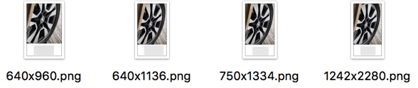

# 启动页

TODO：

* 【已解决】iOS的app中更换启动主视图主页面
* 【已解决】iOS的app界面启动后黑屏

## app启动页的尺寸

* 图片格式：png图片
* 尺寸
  * iOS
    * 包含
      * 640x960
      * 640x1136
      * 750x1334
      * 1242x2280
    * 举例
      * 
  * Android
    * 包含
      * 480x800
      * 720x1280
      * 1080x1920
      * 1440x2560
* 注意
  * 要确保iOS的启动图片的尺寸是正确的，否则会导致启动时无法显示
